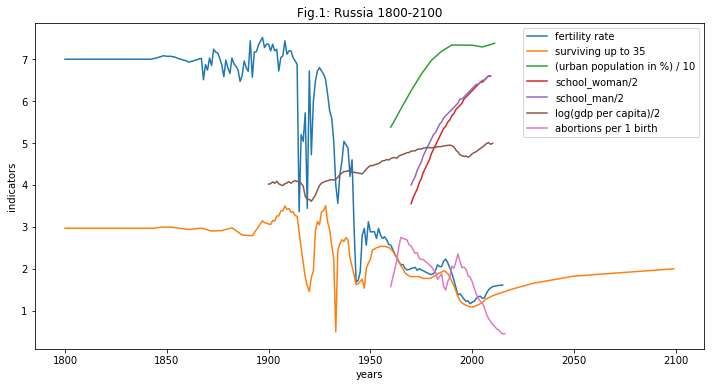
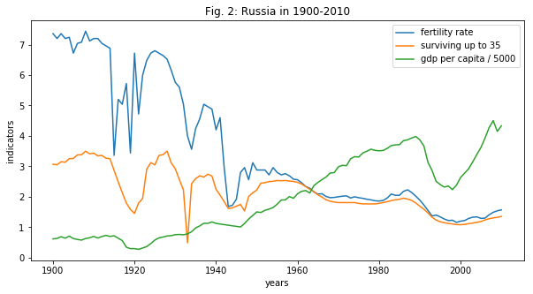
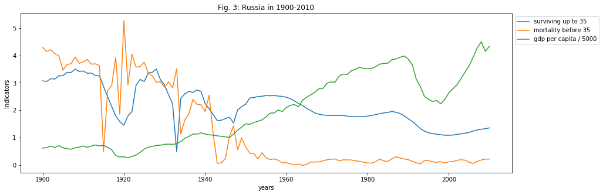
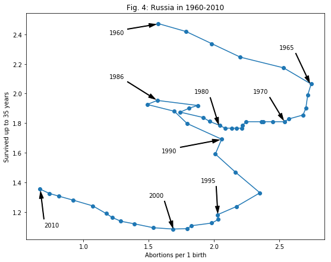
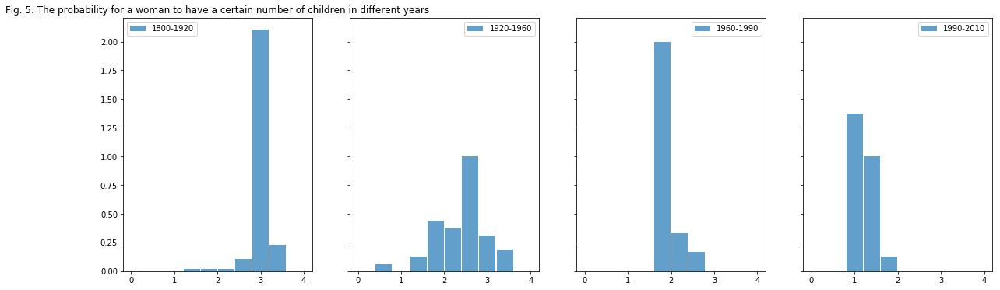
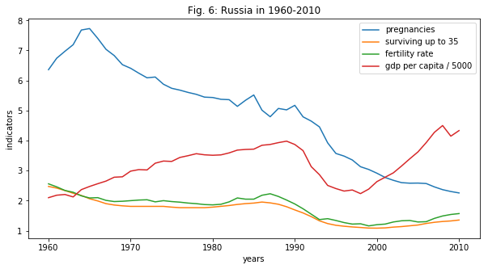
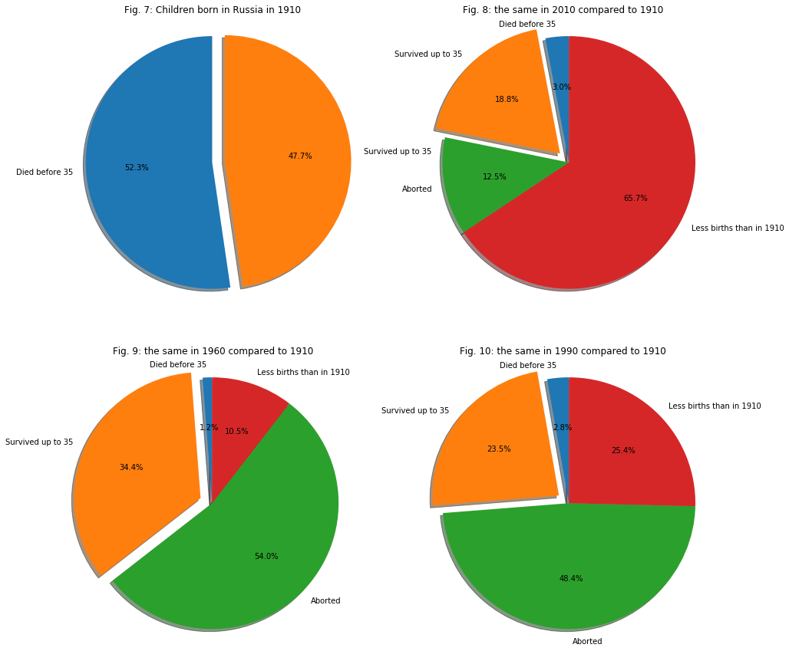
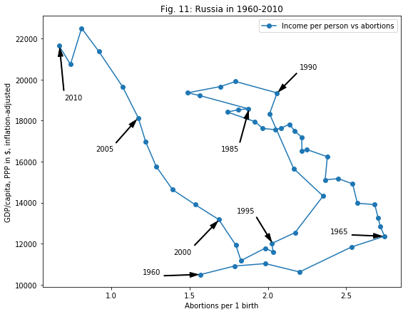

# Project: Demographic transition in Russia
## Table of Contents
<ul>
<li><a href="#intro">Introduction</a></li>
<li><a href="#wrangling">Data Wrangling</a></li>
<li><a href="#eda">Exploratory Data Analysis</a></li>
<li><a href="#conclusions">Conclusions</a></li>
</ul>

<a id='intro'></a>
## Introduction

### The Gapminder World dataset is selected.  

### The questions to investigate: 
### 1. When Russians changed their reproductive behavior and decided to have smaller number of children?
### 2. How fast the transition happened?
### 3. Does the transition correlate with any possibly related indicator?

### The selected datasets:
### 1. Children per woman (total fertility). 
Definition of indicator: Total fertility rate. The number of children that would be born to each woman with prevailing age-specific fertility rates.
### 2. Surviving up to 35.
Definition of indicator. How many children the average couple get that survive up to the age of 35.

This indicator is used instead of child mortality up to 5 years, because children must grow up to the reproductive and economically active age, which may influence the decision of parent to have further children.
### 3. Urban population (% of total).
Definition of indicator	Urban population refers to people living in urban areas as defined by national statistical offices. It is calculated using World Bank population estimates and urban ratios from the United Nations World Urbanization Prospects. Source: United Nations, World Urbanization Prospects.
### 4. Mean years in school (women of reproductive age 15 to 44).
Definition of indicator	The average number of years of school attended by all people in the age and gender group specified, including primary, secondary and tertiary education.
### 5. Mean years in school (men 25 to 34 years).
Definition of indicator	The average number of years of school attended by all people in the age and gender group specified, including primary, secondary and tertiary education.
### 6. Income per person (GDP/capita, PPP in US dollars, inflation-adjusted).

### 7.* The number of abortions per 100 live births in Russia, 1960-2016. (in Russian)

###### * At the exploration phase appeared a need to check the birth control statistics, which is absend in Gapminder. Therefore, the freely available data set on the abortions in Russia from http://www.demoscope.ru/weekly/ssp/sng_abo.php was used. 


```python
# import statements 

import sys
import numpy as np
import pandas as pd
import matplotlib
import matplotlib.pyplot as plt
import seaborn as sns

%matplotlib inline
```

<a id='wrangling'></a>
## Data Wrangling


### General Properties

##### Read the datasets


```python
# 1. Children per woman (total fertility).
fertility_rate   = pd.read_excel('indicator undata total_fertility.xlsx')

#2. Surviving kids per woman.
surviving_kids   = pd.read_excel('indicator survivingkids 35.xlsx')

#3. Urban population (% of total).
urban_population = pd.read_excel('indicator wdi urbanpopulation.xlsx')

#4. Mean years in school (women of reproductive age 15 to 44).
school_woman     = pd.read_excel('Years in school women 15 to 44.xlsx')

#5. Mean years in school (men 25 to 34 years).
school_man       = pd.read_excel('Years in school men 25-34.xlsx')

#6. Income per person (GDP/capita, PPP in US dollars, inflation-adjusted)
gdp_capita       = pd.read_excel('indicator gapminder gdp_per_capita_ppp.xlsx')

#7. The number of abortions per 100 live births in Russia, 1960-2016.
sng_abo          = pd.read_excel('sng_abo.xls')
```

# Explore the shape of the datasets.

#### Fertility rate


```python
# Check number of columns and rows
print('shape:\t\t',fertility_rate.shape)
# Check number of columns and rows without NaN
print('dropna().shape:\t',fertility_rate.dropna().shape)
# Preview
print('*** info ***\n',fertility_rate[:5].info)
```

    shape:		 (260, 217)
    dropna().shape:	 (199, 217)
    *** info ***
     <bound method DataFrame.info of     Total fertility rate  1800  1801  1802  1803  1804  1805  1806  1807  \
    0               Abkhazia   NaN   NaN   NaN   NaN   NaN   NaN   NaN   NaN   
    1            Afghanistan  7.00  7.00  7.00  7.00  7.00  7.00  7.00  7.00   
    2  Akrotiri and Dhekelia   NaN   NaN   NaN   NaN   NaN   NaN   NaN   NaN   
    3                Albania  4.60  4.60  4.60  4.60  4.60  4.60  4.60  4.60   
    4                Algeria  6.99  6.99  6.99  6.99  6.99  6.99  6.99  6.99   
    
       1808  ...   2006  2007  2008  2009  2010  2011  2012  2013  2014  2015  
    0   NaN  ...    NaN   NaN   NaN   NaN   NaN   NaN   NaN   NaN   NaN   NaN  
    1  7.00  ...   6.70  6.46  6.20  5.93  5.66  5.40  5.14  4.90  4.68  4.47  
    2   NaN  ...    NaN   NaN   NaN   NaN   NaN   NaN   NaN   NaN   NaN   NaN  
    3  4.60  ...   1.85  1.80  1.76  1.74  1.74  1.75  1.76  1.77  1.78  1.78  
    4  6.99  ...   2.58  2.66  2.73  2.78  2.82  2.83  2.82  2.80  2.76  2.71  
    
    [5 rows x 217 columns]>
    

#### Surviving up to 35


```python
# Check number of columns and rows
print('shape:\t\t',surviving_kids.shape)
# Check number of columns and rows without NaN
print('dropna().shape:\t',surviving_kids.dropna().shape)
# Preview
print('*** info ***\n',surviving_kids[:5].info)
```

    shape:		 (197, 256)
    dropna().shape:	 (2, 256)
    *** info ***
     <bound method DataFrame.info of        Country  1760  1761  1762  1763  1764  1765  1766  1767  1768  \
    0  Afghanistan   NaN   NaN   NaN   NaN   NaN   NaN   NaN   NaN   NaN   
    1      Albania   NaN   NaN   NaN   NaN   NaN   NaN   NaN   NaN   NaN   
    2      Algeria   NaN   NaN   NaN   NaN   NaN   NaN   NaN   NaN   NaN   
    3       Angola   NaN   NaN   NaN   NaN   NaN   NaN   NaN   NaN   NaN   
    4    Argentina   NaN   NaN   NaN   NaN   NaN   NaN   NaN   NaN   NaN   
    
         ...         2005      2006      2007      2008      2009      2010  \
    0    ...     4.640845  4.541256  4.448306  4.444350  4.349501  4.261427   
    1    ...     1.677838  1.611106  1.563440  1.515774  1.493861  1.474709   
    2    ...     2.272803  2.254173  2.216914  2.188970  2.166401  2.119510   
    3    ...     4.304105  4.193566  4.076119  4.041242  3.928594  3.900603   
    4    ...     2.172529  2.153555  2.134581  2.125094  2.125898  2.106831   
    
           2020      2030      2050      2099  
    0  3.685452  3.130587  2.395757  1.783561  
    1  1.394117  1.422960  1.616161  1.935956  
    2  1.793048  1.608773  1.620913  1.927607  
    3  3.266809  2.678142  2.072378  1.754104  
    4  1.972662  1.881417  1.796143  1.916302  
    
    [5 rows x 256 columns]>
    

#### Urban population


```python
# Check number of columns and rows
print('shape:\t\t',urban_population.shape)
# Check number of columns and rows without NaN
print('dropna().shape:\t',urban_population.dropna().shape)
# Preview
print('*** info ***\n',urban_population[:5].info)
```

    shape:		 (273, 53)
    dropna().shape:	 (206, 53)
    *** info ***
     <bound method DataFrame.info of   Urban population (% of total)  1960     1961     1962     1963     1964  \
    0                      Abkhazia   NaN      NaN      NaN      NaN      NaN   
    1                   Afghanistan   8.0   8.2650   8.5370   8.8090   9.0810   
    2         Akrotiri and Dhekelia   NaN      NaN      NaN      NaN      NaN   
    3                       Albania  30.7  30.8100  30.9150  31.0200  31.1250   
    4                       Algeria  30.5  31.9366  33.3632  34.7898  36.2164   
    
         1965     1966     1967     1968   ...        2002     2003     2004  \
    0     NaN      NaN      NaN      NaN   ...         NaN      NaN      NaN   
    1   9.353   9.6886  10.0242  10.3598   ...     21.1026  21.3624  21.6222   
    2     NaN      NaN      NaN      NaN   ...         NaN      NaN      NaN   
    3  31.230  31.3320  31.4340  31.5360   ...     43.7662  44.7788  45.7914   
    4  37.643  38.0144  38.3858  38.7572   ...     63.1478  64.3282  65.5086   
    
         2005     2006     2007     2008     2009    2010     2011  
    0     NaN      NaN      NaN      NaN      NaN     NaN      NaN  
    1  21.882  22.1534  22.4248  22.6962  22.9676  23.239  23.5472  
    2     NaN      NaN      NaN      NaN      NaN     NaN      NaN  
    3  46.804  47.9076  49.0112  50.1148  51.2184  52.322  53.3846  
    4  66.689  67.7560  68.8230  69.8900  70.9570  72.024  72.8650  
    
    [5 rows x 53 columns]>
    

#### Mean years in school (woman)


```python
# Check number of columns and rows
print('shape:\t\t',school_woman.shape)
# Check number of columns and rows without NaN
print('dropna().shape:\t',school_woman.dropna().shape)
# Preview
print('*** info ***\n',school_woman[:5].info)
```

    shape:		 (175, 41)
    dropna().shape:	 (175, 41)
    *** info ***
     <bound method DataFrame.info of             Row Labels  1970  1971  1972  1973  1974  1975  1976  1977  1978  \
    0          Afghanistan   0.1   0.1   0.1   0.1   0.1   0.1   0.1   0.1   0.2   
    1              Albania   5.6   5.7   5.9   6.0   6.2   6.3   6.5   6.6   6.8   
    2              Algeria   1.4   1.5   1.6   1.7   1.8   1.9   2.1   2.2   2.3   
    3               Angola   0.9   1.0   1.0   1.1   1.1   1.2   1.2   1.3   1.4   
    4  Antigua and Barbuda   8.1   8.3   8.5   8.7   8.8   9.0   9.2   9.4   9.6   
    
       ...   2000  2001  2002  2003  2004  2005  2006  2007  2008  2009  
    0  ...    0.5   0.5   0.5   0.6   0.6   0.6   0.7   0.7   0.7   0.8  
    1  ...    9.8   9.9  10.0  10.1  10.2  10.3  10.4  10.5  10.6  10.7  
    2  ...    5.8   5.9   6.1   6.2   6.4   6.5   6.7   6.8   6.9   7.1  
    3  ...    3.5   3.6   3.7   3.8   3.9   4.0   4.1   4.3   4.4   4.5  
    4  ...   12.7  12.8  12.9  13.0  13.1  13.2  13.3  13.3  13.4  13.5  
    
    [5 rows x 41 columns]>
    

#### Mean years in school (man)


```python
# Check number of columns and rows
print('shape:\t\t',school_man.shape)
# Check number of columns and rows without NaN
print('dropna().shape:\t',school_man.dropna().shape)
# Preview
print('*** info ***\n',school_man[:5].info)
```

    shape:		 (175, 41)
    dropna().shape:	 (175, 41)
    *** info ***
     <bound method DataFrame.info of             Row Labels  1970  1971  1972  1973  1974  1975  1976  1977  1978  \
    0          Afghanistan   1.0   1.1   1.1   1.2   1.3   1.3   1.4   1.4   1.5   
    1              Albania   6.5   6.7   6.9   7.0   7.2   7.3   7.5   7.7   7.8   
    2              Algeria   1.9   2.0   2.1   2.2   2.3   2.4   2.5   2.7   2.8   
    3               Angola   2.3   2.4   2.5   2.7   2.8   2.9   3.0   3.1   3.2   
    4  Antigua and Barbuda   8.0   8.2   8.4   8.6   8.7   8.9   9.1   9.3   9.5   
    
       ...   2000  2001  2002  2003  2004  2005  2006  2007  2008  2009  
    0  ...    2.8   2.9   2.9   3.0   3.0   3.1   3.1   3.2   3.3   3.3  
    1  ...   10.4  10.4  10.5  10.6  10.7  10.7  10.8  10.9  10.9  11.0  
    2  ...    6.3   6.5   6.6   6.7   6.8   7.0   7.1   7.2   7.3   7.3  
    3  ...    5.5   5.6   5.7   5.8   5.8   5.9   6.0   6.0   6.1   6.2  
    4  ...   12.5  12.6  12.7  12.8  12.8  12.9  13.0  13.0  13.1  13.2  
    
    [5 rows x 41 columns]>
    

#### Income per person


```python
# Check number of columns and rows
print('shape:\t\t',gdp_capita.shape)
# Check number of columns and rows without NaN
print('dropna().shape:\t',gdp_capita.dropna().shape)
# Preview
print('*** info ***\n',gdp_capita[:5].info)
```

    shape:		 (262, 217)
    dropna().shape:	 (201, 217)
    *** info ***
     <bound method DataFrame.info of           GDP per capita   1800   1801   1802   1803   1804   1805   1806  \
    0               Abkhazia    NaN    NaN    NaN    NaN    NaN    NaN    NaN   
    1            Afghanistan  603.0  603.0  603.0  603.0  603.0  603.0  603.0   
    2  Akrotiri and Dhekelia    NaN    NaN    NaN    NaN    NaN    NaN    NaN   
    3                Albania  667.0  667.0  668.0  668.0  668.0  668.0  668.0   
    4                Algeria  716.0  716.0  717.0  718.0  719.0  720.0  721.0   
    
        1807   1808   ...        2006     2007     2008     2009     2010  \
    0    NaN    NaN   ...         NaN      NaN      NaN      NaN      NaN   
    1  603.0  603.0   ...      1173.0   1298.0   1311.0   1548.0   1637.0   
    2    NaN    NaN   ...         NaN      NaN      NaN      NaN      NaN   
    3  668.0  668.0   ...      7476.0   7977.0   8644.0   8994.0   9374.0   
    4  722.0  723.0   ...     12088.0  12289.0  12314.0  12285.0  12494.0   
    
          2011     2012     2013     2014     2015  
    0      NaN      NaN      NaN      NaN      NaN  
    1   1695.0   1893.0   1884.0   1877.0   1925.0  
    2      NaN      NaN      NaN      NaN      NaN  
    3   9640.0   9811.0   9961.0  10160.0  10620.0  
    4  12606.0  12779.0  12893.0  13179.0  13434.0  
    
    [5 rows x 217 columns]>
    

#### The number of abortions per 100 live births in Russia, 1960-2016


```python
# Check number of columns and rows
print('shape:\t\t',sng_abo.shape)
# Check number of columns and rows without NaN
print('dropna().shape:\t',sng_abo.dropna().shape)
# Preview
print('*** info ***\n',sng_abo[3:5].info)
```

    shape:		 (79, 18)
    dropna().shape:	 (0, 18)
    *** info ***
     <bound method DataFrame.info of    Unnamed: 0  \
    3         NaN   
    4         NaN   
    
      15 новых независимых государств. Число абортов на 100 живорождений, 1960-2016  \
    3                                                NaN                              
    4                                               1960                              
    
        Unnamed: 2 Unnamed: 3  Unnamed: 4 Unnamed: 5 Unnamed: 6 Unnamed: 7  \
    3  Азербайджан    Армения  Белоруссия     Грузия  Казахстан   Киргизия   
    4            -          -     85.3005    41.6406          -          -   
    
      Unnamed: 8 Unnamed: 9 Unnamed: 10 Unnamed: 11  Unnamed: 12 Unnamed: 13  \
    3     Латвия      Литва    Молдавия      Россия  Таджикистан   Туркмения   
    4          -     58.414     69.0331      157.17            -           -   
    
      Unnamed: 14 Unnamed: 15 Unnamed: 16 Unnamed: 17  
    3  Узбекистан     Украина     Эстония         NaN  
    4           -     138.072     177.912        1960  >
    

### The names in 'sng_abo' appear in cyrilic, since it is a russian source of data.

### Almost all the tables cover different periods of time and contain NaN values.

### Let's check Russia.

##### Set country name as index


```python
fertility_rate   = fertility_rate.set_index('Total fertility rate')
surviving_kids = surviving_kids.set_index('Country')
urban_population = urban_population.set_index('Urban population (% of total)')
school_woman     = school_woman.set_index('Row Labels')
school_man       = school_man.set_index('Row Labels')
gdp_capita       = gdp_capita.set_index('GDP per capita')
```

##### Print the outcome for the first 5 values for Russia


```python
print('fertility_rate\n',end='')
print(fertility_rate.loc['Russia'][:5])
print('surviving_kids\n',end='')
print(surviving_kids.loc['Russia'][:5])
print('urban_population\n',end='')
print(urban_population.loc['Russia'][:5])
print('school_womans\n',end='')
print(school_woman.loc['Russia'][:5])
print('school_man\n',end='')
print(school_man.loc['Russia'][:5])
print('gdp_capita\n',end='')
print(gdp_capita.loc['Russia'][:5])
print('Russia_abortions\n',end='')
russia_abo = sng_abo.iloc[4:61,11]
print(russia_abo[:5])
```

    fertility_rate
    1800    7.0
    1801    7.0
    1802    7.0
    1803    7.0
    1804    7.0
    Name: Russia, dtype: float64
    surviving_kids
    1760   NaN
    1761   NaN
    1762   NaN
    1763   NaN
    1764   NaN
    Name: Russia, dtype: float64
    urban_population
    1960    53.8000
    1961    54.6194
    1962    55.5078
    1963    56.3962
    1964    57.2846
    Name: Russia, dtype: float64
    school_womans
    1970    7.1
    1971    7.4
    1972    7.6
    1973    7.8
    1974    8.1
    Name: Russia, dtype: float64
    school_man
    1970    8.0
    1971    8.2
    1972    8.4
    1973    8.7
    1974    8.9
    Name: Russia, dtype: float64
    gdp_capita
    1800    1430.0
    1801    1432.0
    1802    1433.0
    1803    1435.0
    1804    1437.0
    Name: Russia, dtype: float64
    Russia_abortions
    4    157.17
    5    178.77
    6    198.39
    7    220.21
    8    253.36
    Name: Unnamed: 11, dtype: object
    

### The list of years is different for each table. Therefore, we need to extract years separately for each table.

##### Get years


```python
years_fr = pd.to_numeric(fertility_rate.columns.tolist()[0:])
years_sk = pd.to_numeric(surviving_kids.columns.tolist()[0:])
years_up = pd.to_numeric(urban_population.columns.tolist()[0:])
years_sw = pd.to_numeric(school_woman.columns.tolist()[0:])
years_sm = pd.to_numeric(school_man.columns.tolist()[0:])
years_gdp = pd.to_numeric(gdp_capita.columns.tolist()[0:])
years_abo = pd.to_numeric(sng_abo.iloc[4:61,1])
```

##### Check the difference between consecutive years


```python
print('np.diff(years_fr)\n',np.diff(years_fr))
print('np.diff(years_sk)\n',np.diff(years_sk))
print('np.diff(years_up)\n',np.diff(years_up))
print('np.diff(years_sw)\n',np.diff(years_sw))
print('np.diff(years_sm)\n',np.diff(years_sm))
print('np.diff(years_gdp)\n',np.diff(years_gdp))
print('np.diff(years_abo)\n',np.diff(years_abo))
```

    np.diff(years_fr)
     [1 1 1 1 1 1 1 1 1 1 1 1 1 1 1 1 1 1 1 1 1 1 1 1 1 1 1 1 1 1 1 1 1 1 1 1 1
     1 1 1 1 1 1 1 1 1 1 1 1 1 1 1 1 1 1 1 1 1 1 1 1 1 1 1 1 1 1 1 1 1 1 1 1 1
     1 1 1 1 1 1 1 1 1 1 1 1 1 1 1 1 1 1 1 1 1 1 1 1 1 1 1 1 1 1 1 1 1 1 1 1 1
     1 1 1 1 1 1 1 1 1 1 1 1 1 1 1 1 1 1 1 1 1 1 1 1 1 1 1 1 1 1 1 1 1 1 1 1 1
     1 1 1 1 1 1 1 1 1 1 1 1 1 1 1 1 1 1 1 1 1 1 1 1 1 1 1 1 1 1 1 1 1 1 1 1 1
     1 1 1 1 1 1 1 1 1 1 1 1 1 1 1 1 1 1 1 1 1 1 1 1 1 1 1 1 1 1]
    np.diff(years_sk)
     [ 1  1  1  1  1  1  1  1  1  1  1  1  1  1  1  1  1  1  1  1  1  1  1  1  1
      1  1  1  1  1  1  1  1  1  1  1  1  1  1  1  1  1  1  1  1  1  1  1  1  1
      1  1  1  1  1  1  1  1  1  1  1  1  1  1  1  1  1  1  1  1  1  1  1  1  1
      1  1  1  1  1  1  1  1  1  1  1  1  1  1  1  1  1  1  1  1  1  1  1  1  1
      1  1  1  1  1  1  1  1  1  1  1  1  1  1  1  1  1  1  1  1  1  1  1  1  1
      1  1  1  1  1  1  1  1  1  1  1  1  1  1  1  1  1  1  1  1  1  1  1  1  1
      1  1  1  1  1  1  1  1  1  1  1  1  1  1  1  1  1  1  1  1  1  1  1  1  1
      1  1  1  1  1  1  1  1  1  1  1  1  1  1  1  1  1  1  1  1  1  1  1  1  1
      1  1  1  1  1  1  1  1  1  1  1  1  1  1  1  1  1  1  1  1  1  1  1  1  1
      1  1  1  1  1  1  1  1  1  1  1  1  1  1  1  1  1  1  1  1  1  1  1  1  1
     10 10 20 49]
    np.diff(years_up)
     [1 1 1 1 1 1 1 1 1 1 1 1 1 1 1 1 1 1 1 1 1 1 1 1 1 1 1 1 1 1 1 1 1 1 1 1 1
     1 1 1 1 1 1 1 1 1 1 1 1 1 1]
    np.diff(years_sw)
     [1 1 1 1 1 1 1 1 1 1 1 1 1 1 1 1 1 1 1 1 1 1 1 1 1 1 1 1 1 1 1 1 1 1 1 1 1
     1 1]
    np.diff(years_sm)
     [1 1 1 1 1 1 1 1 1 1 1 1 1 1 1 1 1 1 1 1 1 1 1 1 1 1 1 1 1 1 1 1 1 1 1 1 1
     1 1]
    np.diff(years_gdp)
     [1 1 1 1 1 1 1 1 1 1 1 1 1 1 1 1 1 1 1 1 1 1 1 1 1 1 1 1 1 1 1 1 1 1 1 1 1
     1 1 1 1 1 1 1 1 1 1 1 1 1 1 1 1 1 1 1 1 1 1 1 1 1 1 1 1 1 1 1 1 1 1 1 1 1
     1 1 1 1 1 1 1 1 1 1 1 1 1 1 1 1 1 1 1 1 1 1 1 1 1 1 1 1 1 1 1 1 1 1 1 1 1
     1 1 1 1 1 1 1 1 1 1 1 1 1 1 1 1 1 1 1 1 1 1 1 1 1 1 1 1 1 1 1 1 1 1 1 1 1
     1 1 1 1 1 1 1 1 1 1 1 1 1 1 1 1 1 1 1 1 1 1 1 1 1 1 1 1 1 1 1 1 1 1 1 1 1
     1 1 1 1 1 1 1 1 1 1 1 1 1 1 1 1 1 1 1 1 1 1 1 1 1 1 1 1 1 1]
    np.diff(years_abo)
     [1 1 1 1 1 1 1 1 1 1 1 1 1 1 1 1 1 1 1 1 1 1 1 1 1 1 1 1 1 1 1 1 1 1 1 1 1
     1 1 1 1 1 1 1 1 1 1 1 1 1 1 1 1 1 1 1]
    

### All the years run with a constant step of 1 year, except for the last four values for 'years_sk'.

### Let's check the corresponding values.


```python
years_sk[-6:]
```


    array([2009, 2010, 2020, 2030, 2050, 2099])


##### Plot the outcome for Russia


```python
plt.figure(figsize=(12,6))
plt.plot(years_fr, fertility_rate.loc['Russia'],   label='fertility rate')
plt.plot(years_sk, surviving_kids.loc['Russia'],   label='surviving up to 35')
plt.plot(years_up, urban_population.loc['Russia']/10, label='(urban population in %) / 10')
plt.plot(years_sw, school_woman.loc['Russia']/2,     label='school_woman/2')
plt.plot(years_sm, school_man.loc['Russia']/2,       label='school_man/2')
plt.plot(years_gdp[100:211], np.log(gdp_capita.loc['Russia'][100:211])/2,  label='log(gdp per capita)/2')
plt.plot(years_abo, russia_abo/100,                label='abortions per 1 birth')
plt.title("Fig.1: Russia 1800-2100")
plt.ylabel("indicators")
plt.xlabel('years')
plt.legend(bbox_to_anchor=(1, 1))
plt.show()
```





### One can see that number of years in school and urban population change smoothly and slowly, while other indicators, including the fertility rate and the number of kids surviving up to 35, have rapid changes.

### Therefore, we exclude number of years in school and urban population from the analysis.

### Data Cleaning

### The data are continuous for the corresponding available periods. The most rapid changes of data happen between 1900 and 2010 years. This, probably, indicates that the data for Russia are clean, but unprecise before the year 1900. The number of surviving kids up to 35 after 2010 is obviously an extrapolation. There are rather large changes in the registered period, which could not have been predicted.

### Therefore, the existing data will be used where available instead of extrapolations.

##### Find the indexes for which the years are equal to 1900 and 2010


```python
years = np.array([1900, 2010])
print('years:',years)
index_fr = np.where(np.in1d(years_fr, years))[0]
index_sk = np.where(np.in1d(years_sk, years))[0]
index_gdp = np.where(np.in1d(years_gdp, years))[0]
index_abo = np.where(np.in1d(years_abo, years))[0]

print('fertility rate index:',index_fr)
print('surviving_kids index:',index_sk)
print('gdp per capita index:',index_gdp)
print('russia abo index:',index_abo)
```

    years: [1900 2010]
    fertility rate index: [100 210]
    surviving_kids index: [140 250]
    gdp per capita index: [100 210]
    russia abo index: [50]
    

##### The data on abortions in Russia are not available from 1900. Let's find the first available year.


```python
abo_imin = years_abo.idxmin(axis=0)
print('The first available year is {} with the index {}.'.format(years_abo[abo_imin],abo_imin))
```

    The first available year is 1960 with the index 4.
    

<a id='eda'></a>
## Exploratory Data Analysis

## Research Question 1. 
## When Russians changed their reproductive behavior and decided to have smaller number of children? 

##### Plot the data for Russia in the period from 1900 to 2010


```python
plt.figure(figsize=(10,5))
plt.plot(years_fr[100:211], fertility_rate.loc['Russia'][100:211],   label='fertility rate')
plt.plot(years_sk[140:251], surviving_kids.loc['Russia'][140:251],   label='surviving up to 35')
plt.plot(years_gdp[100:211], gdp_capita.loc['Russia'][100:211]/5000,  label='gdp per capita / 5000') #np.log()/2
plt.title('Fig. 2: Russia in 1900-2010')
plt.ylabel("indicators")
plt.xlabel('years')
plt.legend(bbox_to_anchor=(1, 1))
plt.show()
```





### The number of surviving people is vital for the survival of the population. Therefore, we start the analysis from the 'surviving up to 35' indicator.

### One can see that the number of kids surviving up to 35 years per woman is fluctuating around 2 kids. In the beginning of the century it is closer to 3, while at the end of the century it is closer to 1.

### The number of surviving up to 35 has deep minima. Let's find the corresponding years, values, and try to link them to some known historical and economical processes in Russia.


```python
from scipy.signal import argrelextrema
ymin = argrelextrema(surviving_kids.loc['Russia'][140:251].values, np.less, order=3)[0].tolist()
print('Minima for the probability to survive up to 35 years old. Measures: year of birth and survived kids per woman.')
for i in range(0,len(ymin)):
    print(surviving_kids.loc['Russia'][ymin[i]+140:ymin[i]+141].to_string())
```

    Minima for the probability to survive up to 35 years old. Measures: year of birth and survived kids per woman.
    1901    3.052798
    1920    1.452846
    1933    0.488404
    1943    1.617531
    1947    1.534045
    2000    1.084282
    

### The first minimum in 1901 is in fact the beginning of the increase of the number of kids surviving up to 35. Therefore, it can be excluded.

### The next decrease and the minimum in 1920 may be linked with the World War I, Revolution and Civil War in Russia. Military recruitment age is about 20. Therefore, the following World War II also contributed to the mortality of those born around 1920.

### The minimum in 1933 is the global minimum for the whole 20th century. It may be linked with the Collectivization and the following great famine in the Soviet Union. https://en.wikipedia.org/wiki/Soviet_famine_of_1932%E2%80%9333 

### The minimum in 1943 may correspond to the middle of the World War II on the territory of the USSR.

### The minimum in 1947 may correspond to the Soviet famine of 1946–47 https://en.wikipedia.org/wiki/Soviet_famine_of_1946%E2%80%9347 .

### The minimum in 2000 may correspond to the previous dissolution of the USSR and the following decline of the economy in Russia.

### The good correspondance with the known historical events allows to assume that the available data are of a good quality.

### Let's find also the maxima.


```python
ymax = argrelextrema(surviving_kids.loc['Russia'][140:251].values, np.greater, order=3)[0].tolist()
print('Maxima for the probability to survive up to 35 years old. Measures: year of birth and survived kids per woman.')
for i in range(0,len(ymax)):
    print(surviving_kids.loc['Russia'][ymax[i]+140:ymax[i]+141].to_string())
```

    Maxima for the probability to survive up to 35 years old. Measures: year of birth and survived kids per woman.
    1908    3.497734
    1928    3.50294
    1938    2.743355
    1955    2.536028
    1986    1.953681
    

### One can see that the survival up to 35 recovered in 1928 to the level before the World War I and the Revolution. Later maxima are smaller than the previous ones.

## There is a wide deep between 1955 and 1986, which can not be linked to a war, or any other catastrophic event.

### In order to see it better, let's define a new indicator - 'mortality before 35', which is fertility rate per wonman minus the number of kids, which survived up to 35 per woman, and compare with other indicators, see Fig. 3 below.


```python
plt.figure(figsize=(15,5))
plt.plot(years_sk[140:251], surviving_kids.loc['Russia'][140:251],   label='surviving up to 35')
plt.plot(years_sk[140:251], fertility_rate.loc['Russia'][100:211] - surviving_kids.loc['Russia'][140:251],   
         label='mortality before 35')
plt.plot(years_gdp[100:211], gdp_capita.loc['Russia'][100:211]/5000,  label='gdp per capita / 5000')
plt.title('Fig. 3: Russia in 1900-2010')
plt.ylabel("indicators")
plt.xlabel('years')
plt.legend(bbox_to_anchor=(1, 1))
plt.show()
```





### One can see from Fig. 3 that the 'mortality before 35' decreases after 1920. The wars and famines give local maxima, which, however, are lower than the previous ones.

### After 1960 the absolute value of the 'mortality before 35' is close to zero. It means that all those who were born live at least up to the age of 35 years. They entered the reproductive age and could have had children. Therefore, the decrease of the fertility rate after 1960 seems to be the decision.

### 'In 1920, Russian Soviet Republic became the first country in the world to allow abortion in all circumstances, but over the course of the 20th century, the legality of abortion changed more than once, with a ban being enacted again from 1936 to 1955. Russia had the highest number of abortions per woman of child-bearing age in the world according to UN data as of 2010.' https://en.wikipedia.org/wiki/Abortion_in_Russia

### Let's check the number of born kids versus the number of abortions.

##### Find the indexes for which the years are equal to 1960, 1965, 1970, 1980, 1986, 1990, 1995, 2000 and 2010


```python
years = np.array([1960, 1965, 1970, 1980, 1986, 1990, 1995, 2000, 2010])
print('years:',years)
index_fr = np.where(np.in1d(years_fr, years))[0]
index_sk = np.where(np.in1d(years_sk, years))[0]
index_gdp = np.where(np.in1d(years_gdp, years))[0]
index_abo = np.where(np.in1d(years_abo, years))[0]

print('fertility rate index:',index_fr)
print('surviving_kids index:',index_sk)
print('gdp per capita index:',index_gdp)
print('russia abo index:',index_abo)
```

    years: [1960 1965 1970 1980 1986 1990 1995 2000 2010]
    fertility rate index: [160 165 170 180 186 190 195 200 210]
    surviving_kids index: [200 205 210 220 226 230 235 240 250]
    gdp per capita index: [160 165 170 180 186 190 195 200 210]
    russia abo index: [ 0  5 10 20 26 30 35 40 50]
    

##### Abortion rate in the corresponding years


```python
print(years_abo.iloc[index_abo])
print(russia_abo.iloc[index_abo]/100)
```

    4     1960
    9     1965
    14    1970
    24    1980
    30    1986
    34    1990
    39    1995
    44    2000
    54    2010
    Name: 15 новых независимых государств. Число абортов на 100 живорождений, 1960-2016, dtype: int64
    4      1.5717
    9      2.7447
    14     2.5412
    24     2.0457
    30    1.56549
    34      2.059
    39      2.026
    44      1.687
    54      0.666
    Name: Unnamed: 11, dtype: object
    

##### Number of kids that survived up to 35 per woman in the corresponding years


```python
print(surviving_kids.loc['Russia'].iloc[index_sk])
```

    1960    2.473383
    1965    2.064183
    1970    1.809570
    1980    1.784196
    1986    1.953681
    1990    1.691357
    1995    1.180468
    2000    1.084282
    2010    1.354904
    Name: Russia, dtype: float64
    

##### Plot the outcome


```python
plt.figure(figsize=(9,7))
plt.plot(russia_abo[0:51]/100, surviving_kids.loc['Russia'][200:251], '-o' ,   label='surviving up to 35')
plt.title('Fig. 4: Russia in 1960-2010')
plt.ylabel("Survived up to 35 years")
plt.xlabel('Abortions per 1 birth')
plt.annotate('1960', xy=(1.57, 2.47), xytext=(1.2, 2.4),
            arrowprops=dict(facecolor='black', shrink=0.05, width=1, headwidth=7))
plt.annotate('1965', xy=(2.74, 2.06), xytext=(2.5, 2.3),
            arrowprops=dict(facecolor='black', shrink=0.05, width=1, headwidth=7))
plt.annotate('1970', xy=(2.54, 1.81), xytext=(2.3, 2),
            arrowprops=dict(facecolor='black', shrink=0.05, width=1, headwidth=7)) 
plt.annotate('1980', xy=(2.04, 1.78), xytext=(1.85, 2.),
            arrowprops=dict(facecolor='black', shrink=0.05, width=1, headwidth=7))
plt.annotate('1990', xy=(2.06, 1.69), xytext=(1.6, 1.6),
            arrowprops=dict(facecolor='black', shrink=0.05, width=1, headwidth=7)) 
plt.annotate('1995', xy=(2.03, 1.18), xytext=(1.9, 1.4),
            arrowprops=dict(facecolor='black', shrink=0.05, width=1, headwidth=7)) 
plt.annotate('2000', xy=(1.69, 1.08), xytext=(1.5, 1.3),
            arrowprops=dict(facecolor='black', shrink=0.05, width=1, headwidth=7)) 
plt.annotate('2010', xy=(0.67, 1.35), xytext=(0.7, 1.1),
            arrowprops=dict(facecolor='black', shrink=0.05, width=1, headwidth=7))
plt.annotate('1986', xy=(1.56549, 1.953681), xytext=(1.2, 2.1),
            arrowprops=dict(facecolor='black', shrink=0.05, width=1, headwidth=7))
plt.show()
```





### Figure 4 shows that the number of children was for a long time close to 2 and then to 1 child, almost independently on the number of abortions. It may indicate dominating social models of 2 and 1 children per family, correspondingly. The further pregnancies were, probably, considered as unwanted and aborted.

### Let's illustrate it with the histogram of the distribution of the number of years with a certain number of children in different periods of time.

##### Find the years


```python
years = np.array([1800, 1920, 1960, 1990, 2010])
print('years:',years)
index_fr = np.where(np.in1d(years_fr, years))[0]
index_sk = np.where(np.in1d(years_sk, years))[0]
print('fertility rate index:',index_fr)
print('surviving_kids index:',index_sk)
```

    years: [1800 1920 1960 1990 2010]
    fertility rate index: [  0 120 160 190 210]
    surviving_kids index: [ 40 160 200 230 250]
    


```python
f, (ax1, ax2, ax3, ax4) = plt.subplots(1 , 4, sharey=True , figsize=(20, 6))
ax1.set_title('Fig. 5: The probability for a woman to have a certain number of children in different years')

ax1.hist(surviving_kids.loc['Russia'][40:160], bins = 10, rwidth = 0.95, range = (0,4), normed=1, alpha = 0.7, label = '1800-1920')
ax2.hist(surviving_kids.loc['Russia'][160:200], bins = 10, rwidth = 0.95, range = (0,4), normed=1, alpha = 0.7, label = '1920-1960')
ax3.hist(surviving_kids.loc['Russia'][200:230], bins = 10, rwidth = 0.95, range = (0,4), normed=1, alpha = 0.7, label = '1960-1990')
ax4.hist(surviving_kids.loc['Russia'][230:250], bins = 10, rwidth = 0.95, range = (0,4), normed=1, alpha = 0.7, label = '1990-2010')

ax1.legend()
ax2.legend()
ax3.legend()
ax4.legend()

plt.show()
```





### One can see that the number of children per woman decreases from 3 to 2 and to 1 child.

### Let's estimate the number of pregnancies. As we saw from Fig. 3, almost all children that were born after 1960 survived up to 35. Assuming that each pregnancy would have been saved, one can estimate the number of pregnancies as the number of abortions + the number of survived kids. 


```python
a = russia_abo[0:51]/100
b = surviving_kids.loc['Russia'][200:251]
pregnancies = [i * j +j for i, j in zip(a, b)]

plt.figure(figsize=(10,5))
plt.plot(years_sk[200:251], pregnancies[0:51],   label='pregnancies')
plt.plot(years_sk[200:251], surviving_kids.loc['Russia'][200:251],   label='surviving up to 35')
plt.plot(years_fr[160:211], fertility_rate.loc['Russia'][160:211],   label='fertility rate')
plt.plot(years_gdp[160:211], gdp_capita.loc['Russia'][160:211]/5000,  label='gdp per capita / 5000')
#plt.plot(years_abo, russia_abo/100,                label='abortions per 1 birth')
plt.title('Fig. 6: Russia in 1960-2010')
plt.ylabel("indicators")
plt.xlabel('years')
plt.legend(bbox_to_anchor=(1, 1))
plt.show()
```





### One can see that before 1990 the number of 'pregnancies' was on the level of 5-8 per woman, similarly to the number of births before 1920.

### Let's illustrate this with the pie plots.

##### Find the years and the corresponding indexes


```python
years = np.array([1910, 1960, 1990, 2010])
print('years:',years)
index_fr = np.where(np.in1d(years_fr, years))[0]
index_sk = np.where(np.in1d(years_sk, years))[0]
index_abo = np.where(np.in1d(years_abo, years))[0]
print('fertility rate index:',index_fr)
print('surviving_kids index:',index_sk)
print('abortions index:',index_abo)
```

    years: [1910 1960 1990 2010]
    fertility rate index: [110 160 190 210]
    surviving_kids index: [150 200 230 250]
    abortions index: [ 0 30 50]
    

##### Calculate fertility rate, numbser of surviving kids and the number of abortions


```python
fr_1 = fertility_rate.loc['Russia'].iloc[110]
fr_2 = fertility_rate.loc['Russia'].iloc[160]
fr_3 = fertility_rate.loc['Russia'].iloc[190]
fr_4 = fertility_rate.loc['Russia'].iloc[210]

sk_1 = surviving_kids.loc['Russia'].iloc[150]
sk_2 = surviving_kids.loc['Russia'].iloc[200]
sk_3 = surviving_kids.loc['Russia'].iloc[230]
sk_4 = surviving_kids.loc['Russia'].iloc[250]

#ak_1 = russia_abo.iloc[0]/100
ak_2 = russia_abo.iloc[0]/100
ak_3 = russia_abo.iloc[30]/100
ak_4 = russia_abo.iloc[50]/100
```

##### Plot the outcome


```python
#f, (ax1, ax2, ax3, ax4) = plt.subplots(1 , 4, figsize=(20, 4))
f, ((ax1, ax4), (ax2, ax3)) = plt.subplots(2, 2, sharex='col', sharey='row', figsize=(15, 15))
ax1.set_title('Fig. 7: Children born in Russia in 1910')
ax2.set_title('Fig. 9: the same in 1960 compared to 1910')
ax3.set_title('Fig. 10: the same in 1990 compared to 1910')
ax4.set_title('Fig. 8: the same in 2010 compared to 1910')

sizes1 = [(fr_1-sk_1)/fr_1, sk_1/fr_1]
sizes2 = [(fr_2-sk_2)/fr_1, sk_2/fr_1, ak_2*sk_2/fr_1, (fr_1 - fr_2 - ak_2*sk_2)/fr_1]
sizes3 = [(fr_3-sk_3)/fr_1, sk_3/fr_1, ak_3*sk_3/fr_1, (fr_1 - fr_3 - ak_3*sk_3)/fr_1]
sizes4 = [(fr_4-sk_4)/fr_1, sk_4/fr_1, ak_4*sk_4/fr_1, (fr_1 - fr_4 - ak_4*sk_4)/fr_1]

labels1 = 'Died before 35', 'Survived up to 35'
labels2 = 'Died before 35', 'Survived up to 35', 'Aborted' , 'Less births than in 1910'
labels3 = 'Died before 35', 'Survived up to 35', 'Aborted' , 'Less births than in 1910'
labels4 = 'Died before 35', 'Survived up to 35', 'Aborted' , 'Less births than in 1910'

explode1 = (0, 0.1)  
explode2 = (0, 0.1, 0, 0) 
explode3 = (0, 0.1, 0, 0) 
explode4 = (0, 0.1, 0, 0) 

ax1.pie(sizes1, explode=explode1, labels=labels1, autopct='%1.1f%%', shadow=True, startangle=90)
ax2.pie(sizes2, explode=explode2, labels=labels2, autopct='%1.1f%%', shadow=True, startangle=90)
ax3.pie(sizes3, explode=explode3, labels=labels3, autopct='%1.1f%%', shadow=True, startangle=90)
ax4.pie(sizes4, explode=explode4, labels=labels4, autopct='%1.1f%%', shadow=True, startangle=90)

ax1.axis('equal')
ax2.axis('equal')
ax3.axis('equal')
ax4.axis('equal')

#ax1.legend()
#ax2.legend()
#ax3.legend()

plt.show()
```





### The decrease of the number of 'pregnancies' after 1990 could be the effect of the free market introduction after the fall of the USSR, which made available effective contraception pills and other methods than abortions.

### Ageing of the population after 1960 and emmigration after 1990 may also play an important role.

## Research Question 2. 
## How fast the change to the smaller family happened?

### One can see from Figs: 1-10 that there were in fact three changes, from which two changes hapenned between 1960 and 2010.

### The number of children dropped from the 2.5 per woman to the new number - about 1.8-2 per woman between 1960 and 1965. The number 2.5 was stable since 1955, i.e. after the recovery from the World War II. The new number 1.8-2 was approximately stable up to 1990, i.e. for 25 years. Then it changed in 5 years to the new number 1.2-1.4 per woman. 

### Thus, the first change from a large 'traitional' family with 6-7 children, from which, however, survived only 3, hapenned between 1920 and 1955, i.e. in 35 years.

### The second change from the family with 2-3 children, from which all survived, to the family with 2 kids hapenned between 1960 and 1965, i.e. in 5 years.

### The third change from the family with 2 and sometimes one kid to the family with mostly one kid hapenned between 1990 and 1995, i.e. in 5 years.

### The long periods of stable number of survived children and changing number of abortions indicate that abortions were used as the regulator of the birth rate.

## Research Question 3. 
## Do the changes correlate with any possibly related indicator?

### The estimate of the number of pregnancies before 1990 gives almost the same value as the number of births before 1920. The data on abortions start in 1960 from almost maximal values. It allows to assume that in the period of 1920-1960 years abortions were also used as the main method of birth control.

### The change in 1920-1960 is not covered with one of the main indicators - the number of abortions. The correlations with wars and famines are trivial. Therefore, this period will not be analyzed. 

### The change in 1960-1965 seems to be a cultural phenomenon, because the full control on the birth rate was already reached, there were no any catastrophic events or wars, and the economy was growing.

### The change between 1990 and 1995 may correlate with the decline of the economy after the fall of the USSR.

### Let's check for the correlations with GDP the period of 1960-2010 years, because it is covered with the data on abortions.

##### Find the indexes for which the years are equal to 1960, 1965, 1985, 1990, 1995, 2000, 2005 and 2010


```python
years = np.array([1960, 1965, 1985, 1990, 1995, 2000, 2005, 2010])
print('years:',years)
index_fr = np.where(np.in1d(years_fr, years))[0]
index_sk = np.where(np.in1d(years_sk, years))[0]
index_gdp = np.where(np.in1d(years_gdp, years))[0]
index_abo = np.where(np.in1d(years_abo, years))[0]

print('fertility rate index:',index_fr)
print('surviving_kids index:',index_sk)
print('gdp per capita index:',index_gdp)
print('russia abo index:',index_abo)
```

    years: [1960 1965 1985 1990 1995 2000 2005 2010]
    fertility rate index: [160 165 185 190 195 200 205 210]
    surviving_kids index: [200 205 225 230 235 240 245 250]
    gdp per capita index: [160 165 185 190 195 200 205 210]
    russia abo index: [ 0  5 25 30 35 40 45 50]
    

##### GDP in the corresponding years


```python
print(gdp_capita.loc['Russia'].iloc[index_gdp])
```

    1960    10496.0
    1965    12363.0
    1985    18576.0
    1990    19349.0
    1995    12013.0
    2000    13173.0
    2005    18118.0
    2010    21664.0
    Name: Russia, dtype: float64
    

##### Abortion rate in the corresponding years


```python
print(years_abo.iloc[index_abo])
print(russia_abo.iloc[index_abo]/100)
```

    4     1960
    9     1965
    29    1985
    34    1990
    39    1995
    44    2000
    49    2005
    54    2010
    Name: 15 новых независимых государств. Число абортов на 100 живорождений, 1960-2016, dtype: int64
    4      1.5717
    9      2.7447
    29    1.87542
    34      2.059
    39      2.026
    44      1.687
    49      1.174
    54      0.666
    Name: Unnamed: 11, dtype: object
    

##### Plot the outcome.


```python
plt.figure(figsize=(9,7))
plt.plot(russia_abo[0:51]/100, gdp_capita.loc['Russia'][160:211], '-o',   label='Income per person vs abortions')
plt.annotate('1960', xy=(1.57, 10496), xytext=(1.2, 10500),
            arrowprops=dict(facecolor='black', shrink=0.05, width=1, headwidth=7))
plt.annotate('1965', xy=(2.74, 12363), xytext=(2.4, 12500),
            arrowprops=dict(facecolor='black', shrink=0.05, width=1, headwidth=7))
plt.annotate('1985', xy=(1.88, 18576), xytext=(1.7, 16500),
            arrowprops=dict(facecolor='black', shrink=0.05, width=1, headwidth=7))
plt.annotate('1990', xy=(2.06, 19349), xytext=(2.2, 20500),
            arrowprops=dict(facecolor='black', shrink=0.05, width=1, headwidth=7))
plt.annotate('1995', xy=(2.03, 12013), xytext=(1.8, 13500),
            arrowprops=dict(facecolor='black', shrink=0.05, width=1, headwidth=7))
plt.annotate('2000', xy=(1.69, 13173), xytext=(1.4, 11500),
            arrowprops=dict(facecolor='black', shrink=0.05, width=1, headwidth=7))
plt.annotate('2005', xy=(1.17, 18118), xytext=(0.9, 16500),
            arrowprops=dict(facecolor='black', shrink=0.05, width=1, headwidth=7))
plt.annotate('2010', xy=(0.67, 21664), xytext=(0.7, 19000),
            arrowprops=dict(facecolor='black', shrink=0.05, width=1, headwidth=7))
plt.title('Fig. 11: Russia in 1960-2010')
plt.ylabel("GDP/capita, PPP in $, inflation-adjusted")
plt.xlabel('Abortions per 1 birth')
plt.legend(bbox_to_anchor=(1, 1))
plt.show()
```





### Figure 6 shows negative correlation between the growth of the GDP and the number of abortions since 1965.

### Let's calculate the corresponding correlation coefficients.

##### Correlation between abortions and the GDP from 1960 to 1965.


```python
ind_gdp = range(160, 166)
ind_abo = range(0, 6)
a = gdp_capita.loc['Russia'].iloc[ind_gdp]
b = russia_abo.iloc[ind_abo]
#print('a\n',a)
#print('b\n',b)
print(np.corrcoef(a.astype('float64'),b.astype('float64')))
```

    [[ 1.          0.88223328]
     [ 0.88223328  1.        ]]
    

##### Correlation between abortions and the GDP from 1965 to 1985.


```python
ind_gdp = range(160, 186)
ind_abo = range(0, 26)
a = gdp_capita.loc['Russia'].iloc[ind_gdp]
b = russia_abo.iloc[ind_abo]
print(np.corrcoef(a.astype('float64'),b.astype('float64')))
```

    [[ 1.        -0.2706964]
     [-0.2706964  1.       ]]
    

##### Correlation between abortions and the GDP from 1985 to 1995.


```python
ind_gdp = range(185, 196)
ind_abo = range(25, 36)
a = gdp_capita.loc['Russia'].iloc[ind_gdp]
b = russia_abo.iloc[ind_abo]
#print('a\n',a)
#print('b\n',b)
print(np.corrcoef(a.astype('float64'),b.astype('float64')))
```

    [[ 1.         -0.68806078]
     [-0.68806078  1.        ]]
    

##### Correlation between abortions and the GDP from 1995 to 2010.


```python
ind_gdp = range(195, 211)
ind_abo = range(35, 51)
a = gdp_capita.loc['Russia'].iloc[ind_gdp]
b = russia_abo.iloc[ind_abo]
#print('a\n',a)
#print('b\n',b)
print(np.corrcoef(a.astype('float64'),b.astype('float64')))
```

    [[ 1.         -0.96813141]
     [-0.96813141  1.        ]]
    

### The correlation between the growth of the GDP and the number of abortions in 1960-1965 changed from 0.88 to the anti-correlation -0.27 in 1965-1985, which increased from -0.69 in 1985-1995 to -0.97 in 1995-2010.

<a id='conclusions'></a>
## Conclusions

## 1. The analysed data suggest that demographic transition in Russia occured in three stages. 
##     First, the transition from the 'traditional' family with 6-7 children, from which, however, only 3 survived up to the age of 35, to the family with 2-3 children, from which everyone survived. 
##     Second, the transition to the family with mostly 2 children. 
##     Third, the transition to the family with mostly 1 child. 

## 2. The transitions seem to happen between 1920 and 1955, between 1960 and 1965, and between 1990 and 1995 years.

## 3. The anti-correlation between the rate of abortions and the GDP per capita appeares since 1965, and increases after that time.

### The interpretation of the obtained results should be done with care because of the limitations of methods and assumptions that were done. Namely, the conclusions are made about private life, but based on global indicators. The data on abortions are absend before 1960. The aging and migrations of the population were not included into the analysis.    
