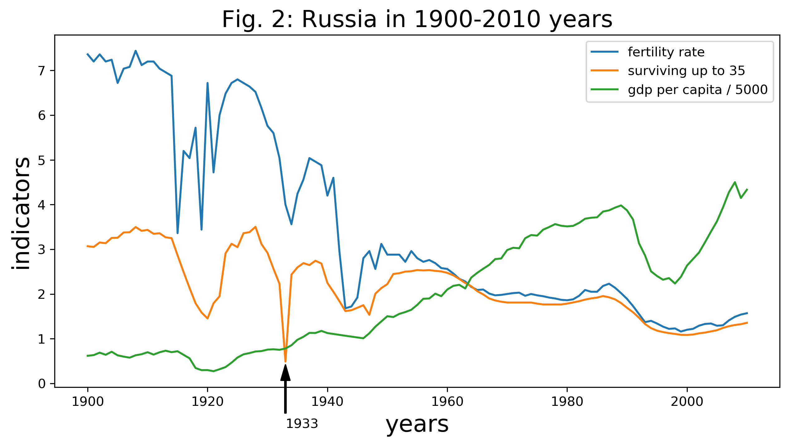
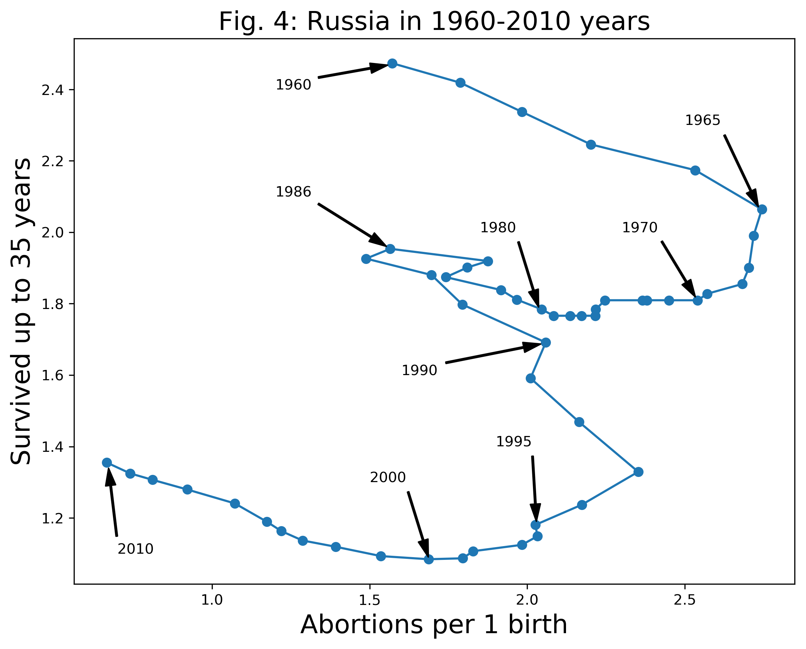

# Demographic transition in Russia

**Purpose:** to **investigate a large freely available dataset** and **go through all typical analysis stages**. Namely, state some clear questions, clean the dataset, explore the data, document all steps, find the answers, use at least two types of visualisations, communicate the findings, explain the limitattions of the analysis and of the conclusions.

The [**Gapminder World**](https://www.gapminder.org/data/) dataset is selected. The reason to look at demography is that migration politics is often in the news and in private talks. I wanted to have a look myself on the data for a country which history I know well. The data for Ukraine before 1991 in `Gapminder World` seems to be taken as the average for the data on Russia. However, the data for Russia include also the Soviet Union and the Russian Empire. Therefore, Russia were selected.  

While working on the project I observed that many features in the data can be understood as a [`demographic transition`](https://en.wikipedia.org/wiki/Demographic_transition). Therefore, the following questions to the data were formulated.

### The questions to investigate:
1. **When** Russians changed their reproductive behavior and decided to have smaller number of children? 
2. **How fast** the transition happened? 
3. Does the transition **correlate** with any possibly related indicator?

Apart from finding answers to the listed questions, some surprising observations occured. Namely, **the worst year to be born** and then survive up to 35 years **in Russia** during the whole 20th century was not during the World War II, but in **1933**, see the figure below.

It may be linked with the [Collectivization](https://en.wikipedia.org/wiki/Collectivization_in_the_Soviet_Union) and the following [great famine in the Soviet Union](https://en.wikipedia.org/wiki/Soviet_famine_of_1932%E2%80%9333), see also [Holodomor](https://en.wikipedia.org/wiki/Holodomor).

Another surprising finding is that **the *average* number of born children per woman** is an approximately constant number for long periods of time. From 1965 to 1990 it is approximately 2, while from 1995 to 2010 it is approximately 1.

The year of [**Chernobyl nuclear power plant explosion**](https://en.wikipedia.org/wiki/Chernobyl_disaster) **was the best for the number of survived kids** per woman from 1964 until now, see the figure below.

Each point is a year.

The whole project can be found in the `Investigate_a_Dataset_2.md` file. 

### Conclusions:
1. The analysed data suggest that demographic transition in Russia occured in **three stages**.
    - First, the transition from the **'traditional' family** with **6-7 children**, from which, however, only **3 survived** up to the age of 35, to the family with **2-3 children**, from which **everyone survived**.

    - Second, the transition to the family with **mostly 2** children.
    - Third, the transition to the family with **mostly 1** child.

2. The transitions seem to happen between **1920 and 1955**, between **1960 and 1965**, and between **1990 and 1995** years.

3. The **anti-correlation** between the **rate of abortions and the GDP per capita** appeares since 1965, and increases after that time.

The interpretation of the obtained results should be done with care because of the limitations of methods and assumptions that were done. Namely, the conclusions are made about private life, but based on global indicators. The data on abortions are absend before 1960. The aging and migrations of the population were not included into the analysis.

**Prerequisites and used libraries:** [Python](https://www.udacity.com/) enviroment (e.g. [Anaconda](https://www.anaconda.com)), [Jupyter Notebook](https://jupyter.org/), [Pandas](https://pandas.pydata.org/), [NumPy](https://numpy.org/), [seaborn](https://seaborn.pydata.org/), [Matplotlib](https://matplotlib.org), [SciPy](https://www.scipy.org/scipylib/), see the `requirements.txt` file for the list of all installed packages.
